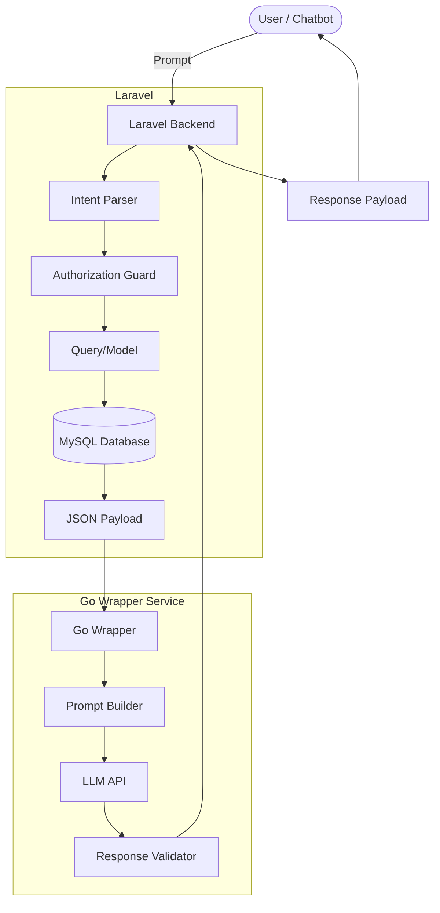
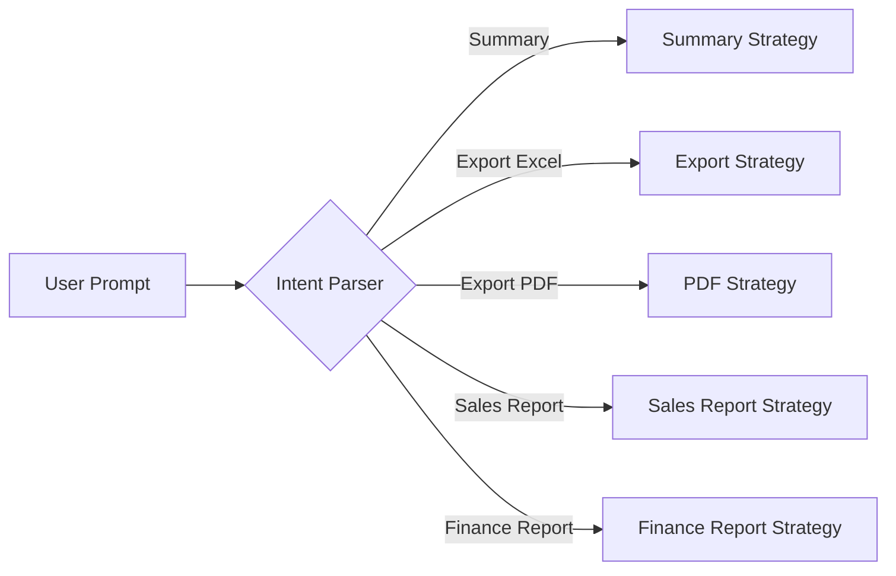
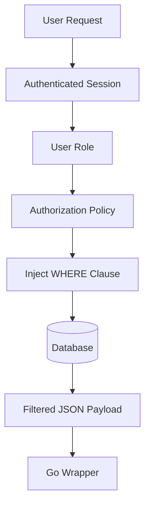
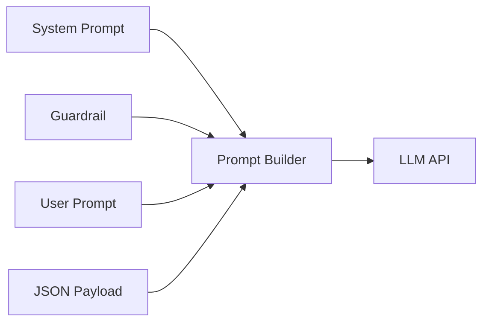
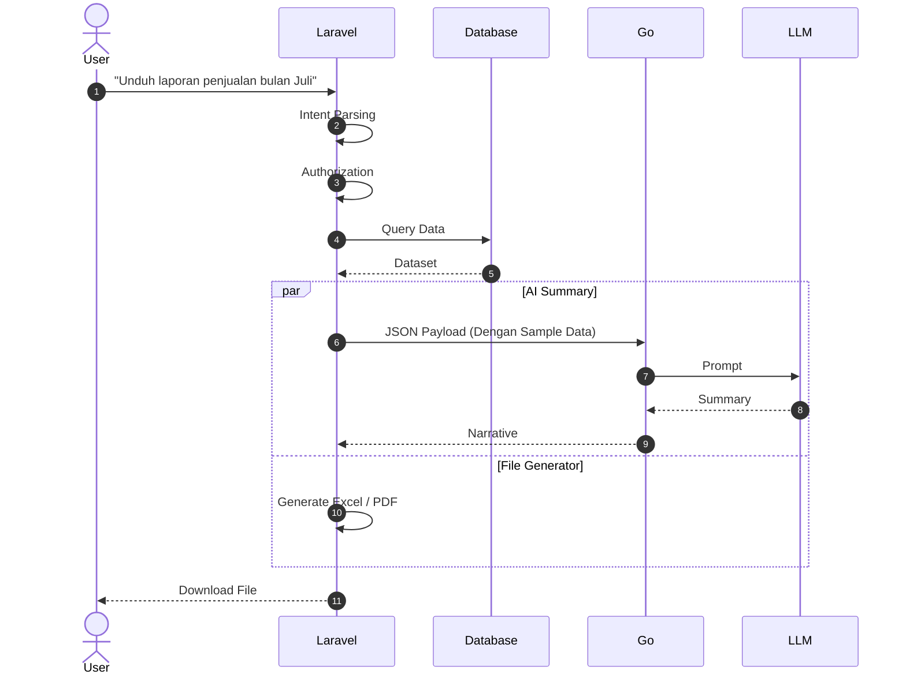
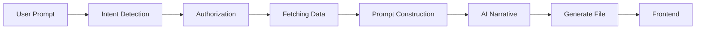
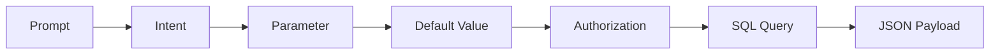
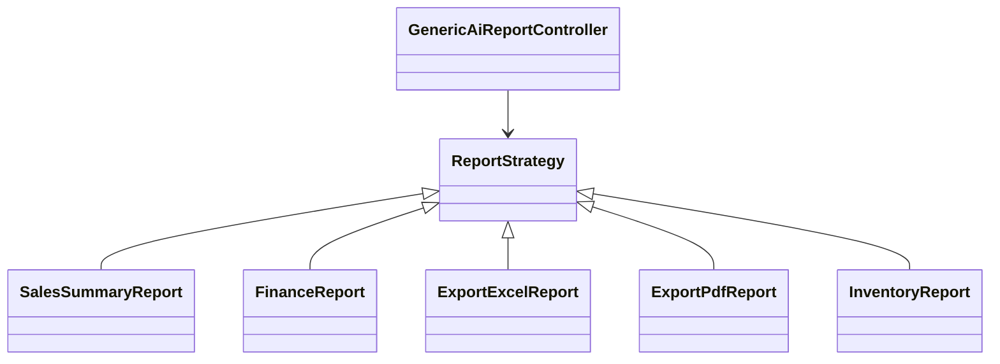
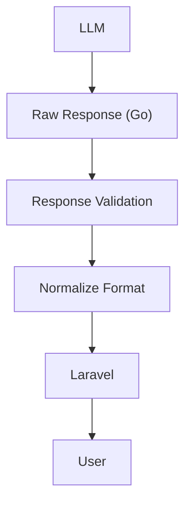
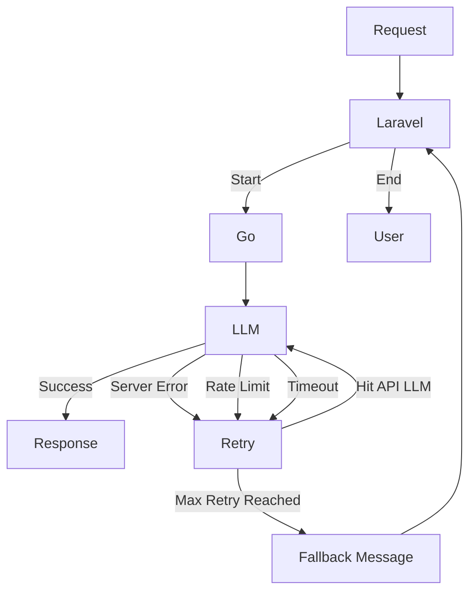

 # Dokumen Arsitektur Teknis: Workflow AI Wrapper

**Spesifikasi:** Laravel 11+ (Core Project), Go 1.2.1+ (Gin), Database MySQL 5.7.2+

---

# 1. Pendahuluan

Sistem akan dibagi menjadi tiga komponen utama.

| Komponen | JobDes |
|----------|----------------|
| **Laravel (Core Project)** | Authentication, Authorization, Intent Parsing, Query Builder, Business Logic, Response Formatter |
| **Go Wrapper Service** | Prompt Builder, Guardrail, LLM Communication, Response Validation |
| **Large Language Model (LLM)** | Mengubah payload JSON menjadi narasi bahasa alami berdasarkan data yang diberikan |

> Catatan : Seluruh data numerik, perhitungan, dan logika bisnis berasal dari Laravel dan database.

---

# 2. Arsitektur Sistem



## Penjelasan Alur

1. Pengguna mengirimkan pertanyaan (prompt).
2. Laravel melakukan identifikasi maksud dari user (*Intent Parsing*).
3. Laravel menerapkan seluruh aturan otorisasi.
4. Laravel mengambil data dari database.
5. Laravel menyusun payload JSON Sample Data Dan Keseluhan.
6. Payload Sample Data dikirim menuju Go Wrapper.
7. Go menyusun prompt berdasarkan template standar (*Prompt Construction*).
8. Prompt dikirim ke LLM.
9. LLM mengembalikan response.
10. Go melakukan validasi respons sebelum dikembalikan ke Laravel.
11. Laravel memformat hasil akhir.
12. Response akhir dikirim kembali ke user.

---

# 3. Intent Parsing

Menggunakan Pendekatan **Strategy Pattern**, untuk menentukan kebutuhan saya berdasarkan prompt



> Catatan : Penambahan modul baru sangat EZ, hanya menambahkan implementasi Strategy baru tanpa mengubah mekanisme parser yang sudah ada.

---

# 4. Pengecekan Otorisasi (Hak Akses)

Seluruh pembatasan hak akses dilakukan di Laravel sebelum data dikirim ke Go Wrapper.



---

# 5. Prompt Construction

Go Wrapper bertugas menyusun prompt yang konsisten sebelum dikirim ke LLM. Terdiri dari 3 bagian :

1. Data hasil query Laravel (Sample Data).
2. Prompt Template.
3. System Instruction (Guardrail).


## A. System Prompt

Berisi instruksi dasar yang mendefinisikan peran dan tujuan LLM. Instruksi ini selalu dikirim pada setiap permintaan.

```text
Anda adalah AI Assistant untuk sistem pelaporan perusahaan.
Jawaban harus berdasarkan data yang diberikan dan menggunakan Bahasa Indonesia yang profesional.
```

---

## B. Guardrail

Berisi aturan yang membatasi perilaku LLM agar tidak menghasilkan informasi yang bertentangan dengan kebijakan sistem.

```text
- Gunakan hanya data yang tersedia.
- Jangan membuat asumsi baru.
- Jangan mengubah nilai numerik.
- Tolak permintaan di luar hak akses pengguna.
```

---

## C. User Prompt

Berisikan prompt dari user

```text
Minta ringkasan performa penjualan bulan Juli.
```

---

## D. JSON Payload

Berisi data faktual yang sudah diproses di laravel.

---

# 6. Alur Kerja Permintaan File (Export Excel/PDF Workflow)

## Export Workflow



---

## Tahapan Proses Export



### A. Intent Detection

Laravel mendeteksi bahwa pengguna menginginkan file.

---

### B. Authorization

Hak akses user diperiksa terlebih dahulu. Dan parameter menyesuaikan setelan default atau sesuai permintaan user

---

### C. Data Fetching

Mengambil data yang diperlukan aberdasarkan parameter sebelum dikirimkan ke Go wrapper

---

### D. Prompt Construction

Go membangun Prompt dan mengirimkannya ke LLM.

---

### E. AI Narrative

LLM menerima data JSON dari Go dan akan menghasilkan narasi seperti:

> "Penjualan bulan Juli mengalami peningkatan sebesar 14% dibandingkan bulan sebelumnya."

---

### F. File Generation

Laravel Generate File. Hasil akhir Response mengembalikan Narasi AI yang sebagai response dar chatbot sebagai ringkasan sebelum bisa download file.

---

# 7. Generic Mapping Matrix

Pencegahan ketika prompt user kurang jelas.

Sebagai contoh:

> "Tampilkan penjualan bulan ini."

Pengguna tidak menyebutkan:

- cabang
- divisi
- rentang tanggal lengkap
- owner

Backend akan menset parameter berdasarkan session dan pengaturan default (Hardcode). G Ribet, Cihuy >.<

| Komponen | Input Pengguna | Nilai Default | Security Layer |
|-----------|---------------|---------------|----------------|
| Time | Bulan/Tahun | Periode berjalan | Tidak boleh melewati batas izin |
| Entity | Cabang / Owner | Session Login | Dipaksa menggunakan hak akses |
| Metrics | Total, Count, Average | Konfigurasi Modul | Tidak membuka struktur database |

---

## Flow Mapping



---

# 8. Strategy Pattern

## Struktur Folder

Agar setiap jenis laporan mudah dikembangkan, sistem menggunakan **Strategy Pattern**.

Contoh struktur folder:

```text
app/

├── Http/
│   └── Controllers/
│       └── GenericAiReportController.php
│
└── Services/
    └── Reporting/
        ├── ReportStrategyInterface.php
        ├── ReportRegistry.php
        └── Strategies/
            ├── SalesSummaryReport.php
            ├── FinanceReport.php
            ├── ExportExcelReport.php
            ├── ExportPdfReport.php
            └── InventoryReport.php
```

Diagram berikut menggambarkan hubungan antar class.



> Catatan : Tidak perlu merubah controller, cukup membuat satu Strategy baru dan mendaftarkannya ke ReportRegistry.

Contoh method ReportStrategyInterface
```
- detect()
- buildPayload()
- generate()
- validate()
```

---

# 9. Payload API (Laravel -> Go)

Setiap modul hanya bertanggung jawab mengubah isi `factual_payload`, sedangkan struktur utama payload tetap sama.

```json
{
    "metadata": {
        "generated_at": "2026-07-28T13:30:15+07:00",
        "timezone": "Asia/Jakarta",
        "locale": "id-ID",
        "currency": "IDR",
        "report_version": "v1.0",
    }
    "configuration": {
        "module": "sales",
        "response_language": "id",
        "response_format": "markdown"
    }
    "request_tracking_id": "req-99x2-2026" // Id Tracking Request,
    "user_original_query": "Minta ringkasan performa data periode ini" // Prompt User,
    "context_auth": {
        "user_id": 847,
        "user_role": "Owner",
        "enforced_data_scope": "Owner_ARM/F14/"
    },
    "extracted_parameters": {
        "detected_intent": "GENERIC_PERFORMANCE_SUMMARY",
        "time_period": {
            "start_date": "2026-07-01",
            "end_date": "2026-07-31"
        }
    },
    "factual_payload": {
        "target_module": "operational_metrics",
        "summary": {
            "total_sales": 894500000,
            "transaction_count": 412
        },
        "details": [
            {
                "id_trx": "ARM/F14/001",
                "kd_cabang": "ARM/F14/",
                "nm_cabang": "Golden Eagle",
                "TOTAL": 10000,
                ....
            },
            {
                "id_trx": "ARM/F14/002",
                "kd_cabang": "ARM/F14/",
                "nm_cabang": "Golden Eagle",
                "TOTAL": 20000,
                ....
            },
            .... // Data lainnya
        ]
    }
}
```

---

## A. metadata

Berisi informasi mengenai karakteristik payload yang dikirim. Data pada bagian ini **bukan merupakan data bisnis**, melainkan informasi pendukung yang membantu proses logging, audit, kompatibilitas, dan interpretasi data.

| Field | Fungsi |
|--------|--------|
| `generated_at` | Menyimpan waktu pembuatan payload. Digunakan untuk audit, logging, debugging, serta memastikan data yang diproses sesuai dengan waktu permintaan pengguna. |
| `timezone` | Menentukan zona waktu yang digunakan sehingga interpretasi tanggal dan waktu tetap konsisten. |
| `locale` | Menentukan format lokal seperti bahasa, format tanggal, angka, dan penulisan nilai mata uang. |
| `currency` | Menjelaskan mata uang yang digunakan pada seluruh data finansial sehingga LLM tidak salah menginterpretasikan nilai numerik. |
| `report_version` | Menunjukkan versi struktur payload agar perubahan format di masa depan tetap kompatibel dengan Go Wrapper. |

---

## B. configuration

Berisi konfigurasi yang mengatur bagaimana Go Wrapper dan LLM memproses permintaan. Nilai pada bagian ini **tidak berasal dari database**, melainkan ditentukan oleh backend sesuai kebutuhan sistem.

| Field | Fungsi |
|--------|--------|
| `module` | Menentukan modul atau domain bisnis yang sedang diproses, misalnya `sales`, `finance`, atau `inventory`. Digunakan untuk memilih prompt template yang sesuai. |
| `response_language` | Menentukan bahasa yang harus digunakan oleh LLM pada hasil akhir. |
| `response_format` | Menentukan format keluaran AI, misalnya `markdown`, `plain_text`, atau `json`. |

---

## C. request_tracking_id

Merupakan identitas unik (**Unique Request Identifier**) untuk setiap permintaan yang dikirim ke Go Wrapper.

Field ini digunakan untuk:

- menghubungkan log Laravel, Go Wrapper, dan AI Provider;
- mempermudah proses debugging;
- melakukan audit request;
- melakukan tracing apabila terjadi kesalahan.

```json
{
    "request_tracking_id": "req-99x2-2026"
}
```

---

## D. user_original_query

Berisi pertanyaan asli yang diketik oleh pengguna.

Field ini digunakan sebagai referensi utama bagi Go Wrapper ketika membangun prompt yang akan dikirim ke LLM. Prompt ini **tidak dimodifikasi**, sehingga maksud asli pengguna tetap dapat dipertahankan.

```json
{
    "user_original_query": "Minta ringkasan performa data periode ini"
}
```

---

## E. context_auth

Berisi informasi mengenai hak akses pengguna yang telah diverifikasi oleh Laravel.

LLM **tidak bertanggung jawab melakukan otorisasi**, sehingga seluruh pembatasan data dilakukan terlebih dahulu oleh Laravel.

| Field | Fungsi |
|--------|--------|
| `user_id` | Identitas pengguna yang melakukan permintaan. |
| `user_role` | Role pengguna, misalnya Owner, Supervisor, atau Admin. |
| `enforced_data_scope` | Ruang lingkup data yang diperbolehkan untuk diakses berdasarkan hak akses pengguna. |

Dengan adanya informasi ini, Go Wrapper dapat mengetahui bahwa data yang diterima sudah sesuai dengan kebijakan keamanan sistem.

---
## F. extracted_parameters

Berisi hasil proses **Intent Parsing** yang dilakukan oleh Laravel.

Bagian ini merupakan representasi hasil analisis backend terhadap permintaan pengguna sehingga Go Wrapper tidak perlu melakukan parsing ulang.

| Field | Fungsi |
|--------|--------|
| `detected_intent` | Jenis permintaan yang berhasil dikenali oleh sistem. |
| `time_period` | Rentang waktu hasil ekstraksi dari prompt pengguna atau parameter default sistem. |

```json
{
    "detected_intent": "GENERIC_PERFORMANCE_SUMMARY",
    "time_period": {
        "start_date": "2026-07-01",
        "end_date": "2026-07-31"
    }
}
```

---

## G. factual_payload

Berasal dari hasil query di laravel yang telah melalui proses :

- Authentication
- Authorization
- Business Logic
- Query Filtering
- Data Aggregation

> Catatan : Go Wrapper maupun LLM **tidak diperbolehkan mengubah isi factual_payload**.

### a. target_module

Menunjukkan jenis data bisnis yang dikirim.

```json
{
    "target_module": "operational_metrics",
}
```

---

### b. summary

Berisi data hasil agregasi yang sudah dihitung.

```json
{
    "total_sales": 894500000,
    "transaction_count": 412
}
```

> Catatan : Digunakan untuk narasi, dan mengurangi resiko halu

---

### details

Berisi sample data detail hasil query database yang sudah diolah di laravel.

```json
{
    "id_trx": "ARM/F14/001",
    "kd_cabang": "ARM/F14/",
    "nm_cabang": "Golden Eagle",
    "TOTAL": 10000
}
```

---

# 10. Response Validation (Go)

Diagram berikut menunjukkan mekanisme validasi response dari LLM.



Beberapa validasi yang dapat dilakukan antara lain:

- memastikan respons tidak kosong.
- memastikan format sesuai.
- menghapus karakter yang tidak diperlukan.
- menyaring kata-kata yang tidak diinginkan.
- menambahkan metadata apabila diperlukan.

---

# 11. Error Handling

Diagram berikut menunjukkan mekanisme penanganan kesalahan.



---

## Retry Policy

| Kondisi | Tindakan |
|----------|----------|
| Timeout | Retry |
| HTTP 422 (Invalid Response) | Validasi Ulang |
| HTTP 429 (Rate Limit) | Retry dengan Backoff |
| HTTP 500 (Server Error) | Retry |
| Max Retry (Rate Limit) | Kirim Pesan Fallback |

---

# 12. Final Destination (Checklist yang perlu diperhatikan)

<h2> 1. Laravel</h2>

```
- Authentication
- Authorization
- Intent Detection
- Middleware
- Validation
- Logging
- Queue (Mungkin Perlu, Mungkin Tidak Tergantung Scenario Coy)
```

---

<h2> 2. Go Wrapper (Gin)</h2>

```
- API Key Internal
- Prompt Template (JSON, Template, Guardrail)
- Retry Policy
- Timeout
- Logging
- Response Validation
```

---

<h2> 3. Database</h2>

```
- Indexing
- Query Optimization
- Monitoring
```

---

<h2> 4. AI Provider</h2>

```
- API Key
- Model
- Rate Limit
- Timeout
- Monitoring
```

---

## Sekuriti Concern (Biar Tidak Boncos Token Dan Bocor Bocor)

> ***Prompt Injection Protection***
>
> Perhatikan agar tidak bisa Menjalankan injeksi code atau prompt yang menyalahi aturan awal (Multi User-Multi Role, Intent Parsing, Authorization Guard)
Bila Permintaan tidak bisa dikategorikan di Intent Parsing, kembalikan pesan berikut :
>
> **"Yo Ndak Tau Kok Tanya Saya"**

---

## Sensitive Data Protection (ISO 27701 / ISO 27001, PDP dan PII Concern Cuy)
Jangan Kirim Data Berikut Sebagai Sample Data ke LLM:

```
-> Password,
-> Access Token,
-> Session ID,
-> API Key,
-> Data pribadi yang tidak diperlukan
```

> Catatan : Jika memang perlu kirim data tsb, data harus di Redacted biar tdk di training sama Om Sam Altman

---

## 13. Referensi
- Roadmap SH [Roadmap](https://roadmap.sh/ai-engineer).
- promptingguide [promptingguide](https://www.promptingguide.ai).
- Medium com [Medium](https://medium.com/@padlanalqinsi/implementasi-sederhana-gemini-api-dalam-pembuatan-custom-chatbot-menggunakan-go-84fe7b81e565).
