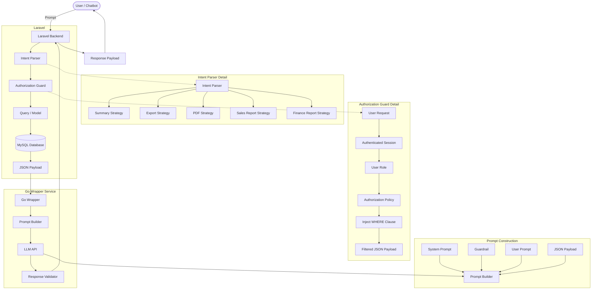

Full Flowchart

```mermaid
graph TD

    User([User / Chatbot])
    User -->|Prompt| LaravelApp

    subgraph Laravel
        LaravelApp[Laravel Backend]
        Intent[Intent Parser]
        Auth[Authorization Guard]
        Query[Query / Model]
        DB[(MySQL Database)]
        PayloadDB[JSON Payload]

        LaravelApp --> Intent
        Intent --> Auth
        Auth --> Query
        Query --> DB
        DB --> PayloadDB
    end

    subgraph "Intent Parser Detail"
        direction TB

        IntentRoot["Intent Parser"]
        IntentRoot --> Summary["Summary Strategy"]
        IntentRoot --> Excel["Export Strategy"]
        IntentRoot --> PDF["PDF Strategy"]
        IntentRoot --> Sales["Sales Report Strategy"]
        IntentRoot --> Finance["Finance Report Strategy"]
    end

    Intent -.-> IntentRoot

    subgraph "Authorization Guard Detail"
        direction TB

        Req["User Request"]
        Session["Authenticated Session"]
        Role["User Role"]
        Policy["Authorization Policy"]
        Filter["Inject WHERE Clause"]
        PayloadAuth["Filtered JSON Payload"]

        Req --> Session
        Session --> Role
        Role --> Policy
        Policy --> Filter
        Filter --> PayloadAuth
    end

    Auth -.-> Req

    PayloadDB --> Go

    subgraph "Go Wrapper Service"
        Go["Go Wrapper"]
        Builder["Prompt Builder"]
        LLM["LLM API"]
        Validator["Response Validator"]

        Go --> Builder
        Builder --> LLM
        LLM --> Validator
    end

    subgraph "Prompt Construction"
        System["System Prompt"]
        Guardrail["Guardrail"]
        User2["User Prompt"]
        Payload["JSON Payload"]

        System --> Builder2
        Guardrail --> Builder2
        User2 --> Builder2
        Payload --> Builder2

        Builder2["Prompt Builder"]
    end

    LLM --> Builder2
    Validator --> LaravelApp
    LaravelApp --> Response["Response Payload"]
    Response --> User
```
